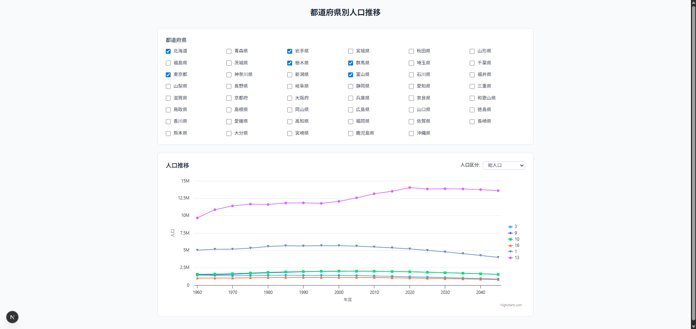

# ゆめみパスポート コーディングテスト課題
[](https://github.com/suzuki3jp/YumemiPassport/actions/workflows/ci.yaml)
[](https://codecov.io/gh/suzuki3jp/YumemiPassport)

[ゆめみパスポート](https://hrmos.co/pages/yumemi/jobs/101000000010) フロントエンドコーディング試験用のリポジトリ



# 参考情報
- **リポジトリ**: https://github.com/suzuki3jp/yumemipassport
- **デプロイ先URL**: https://yumemi-passport.suzuki3.jp/
- **課題の作業合計時間**: 13 時間
- **総合的なプログラミング歴**: 4 年
- **Webフロントエンド開発歴**: 1 年
- **今回の課題の参考資料**: https://zenn.dev/akfm/books/nextjs-basic-principle

# ディレクトリ構成、設計
```ts
src
├─app
│  ├─_components     // ページ固有のコンポーネント
│  └─page.tsx
├─components
├─contexts
├─features           // 機能単位で分割しコロケーション
│  ├─population      // 人口に関するコード
│  └─prefecture      // 都道府県に関するコード
└─lib
```
ディレクトリ構成の方針は以下: 
- トップレベルでは `feature-based` なディレクトリ構成にすることでコロケーションを行う。
- 各 `feature` ディレクトリ配下では `type-based` なディレクトリを作成し、UIとロジックを分離し、テスト可能にする
- `src` 直下のディレクトリは汎用的なコードを配置する場所とし、それらのコードはパッケージとして切り出しても成立するような完成度の高い API を持つべきである。

コードの方針は以下:
- 各コードは責務の分離を行い、依存性注入などによってテストしやすいように
- UI 部分では Container / Presentational パターンを採用し、テストしやすいように


<details>

<summary>**不採用のアーキテクチャ、設計、デザインパターンとその理由**</summary>

### 過剰設計として不採用
- Atomic Design
- レイヤードアーキテクチャ（その他 `layer-based` なアーキテクチャ）
  - ディレクトリ構成では採用していないが、コード部分の考え方としてはテストがしやすくなるため、採用。

</details>

# テストについて
`Vitest`, `React Testing Library` を使用。カバレッジは `Codecov` で監視。  

テスト方針は以下:
- ロジック部分のユニットテストを重点的に行う
- UI テストは今回の規模だと手間の割に成果が小さいので、汎用コンポーネントのみをテストし、他は適宜。
- e2e テストに関しても今回のように規模が小さく、複雑な遷移もない場合手動テストのほうが早く、安定するため不採用

# API について
API 使用に関する方針: 
- レスポンスは `zod` スキーマでパース
- APIキーは `.env` で管理
- 都道府県情報、人口情報はキャッシュを保持し、二度目以降の fetch タイミングではキャッシュから値を返す
  - API の特性上短期間での再フェッチで値が変わることは考えづらいため
- リクエストに失敗した場合は規定回数リトライする
